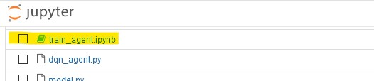

# Banana Collector

We train an ```agent``` to navigate in a large square shaped space and collect yellow bananas while avoiding blue bananas. The agent interacts and receives feedback from ([Unity ML Agent](https://github.com/Unity-Technologies/ml-agents)) envionment using Python API.

The ```state space``` is 37 dimensional space and contains the agent's velocity, along with ray-based perception of objects around agent's forward direction. The agent has to learn which one of the following four ```actions``` to take in any given state:
- ```0``` - move forward.
- ```1``` - move backward.
- ```2``` - turn left.
- ```3``` - turn right.

The task is episodic and the environment is considered solved when the agent manages to score of +13 on average over 100 consecutive episodes.


Read more about training process and results in the [report](/Report.md). :monkey:

### Getting Started

To run the code, you need Python 3.6 environment with required dependencies installed.
1. Create environment

```
conda create --name bananaproject python=3.6
source activate bananaproject
```


2. Clone this repository and install requirements

```
git clone https://github.com/tomkommando/BananaProject.git
cd BananaProject
pip install -r requirements.txt
```

3. You may need to download a Udacity Banana Project environment. Pick a version that match your operating system.
    - Linux: [click here](https://s3-us-west-1.amazonaws.com/udacity-drlnd/P1/Banana/Banana_Linux.zip)
    - Mac OSX: [click here](https://s3-us-west-1.amazonaws.com/udacity-drlnd/P1/Banana/Banana.app.zip)
    - Windows (32-bit): [click here](https://s3-us-west-1.amazonaws.com/udacity-drlnd/P1/Banana/Banana_Windows_x86.zip)
    - Windows (64-bit): [click here](https://s3-us-west-1.amazonaws.com/udacity-drlnd/P1/Banana/Banana_Windows_x86_64.zip)
    
    (_For Windows users_) Check out [this link](https://support.microsoft.com/en-us/help/827218/how-to-determine-whether-a-computer-is-running-a-32-bit-version-or-64) if you need help with determining if your computer is running a 32-bit version or 64-bit version of the Windows operating system.

    (_For AWS_) If you'd like to train the agent on AWS (and have not [enabled a virtual screen](https://github.com/Unity-Technologies/ml-agents/blob/master/docs/Training-on-Amazon-Web-Service.md)), then please use [this link](https://s3-us-west-1.amazonaws.com/udacity-drlnd/P1/Banana/Banana_Linux_NoVis.zip) to obtain the environment.

2. Place the file in the BananaProject GitHub repository folder, and unzip (or decompress) the file.
 
### Instructions
In order to run the code:

1. Activate environment:

```
source activate bananaproject
```

2. Make sure you are in the correct folder.
```
cd BananaProject
```
3. start jupyter notebook server

```
jupyter notebook
```

4. Open your browser and connect to the Jupyter Notebook server in the local host address: http://127.0.0.1:8888/. You may need to enter Token which is printed out in the console when you start the Jupyter Notebook server, alternatively you can choose a password for yourself.

5. Run ```train_agent.ipynb``` and follow the instructions in the file to train an agent or watch a trained agent playing!


