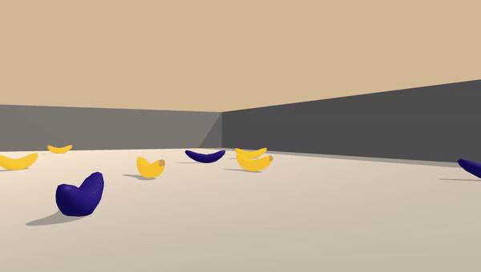
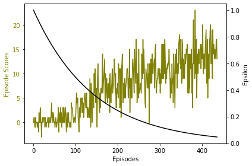
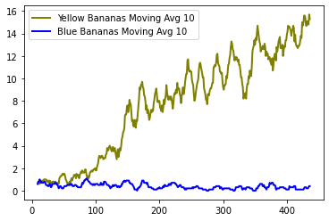

# Banana Collector Project

### Project Details
We train an ```agent``` to navigate in a large square shaped space and collect yellow bananas while avoiding blue bananas. The agent interacts and receives feedback from [Unity ML Agent](https://github.com/Unity-Technologies/ml-agents) envionment using Python API. The problem is considered solved when the agent manages to collect 13 bananas on average over 100 consecutive episodes.

The ```state space``` is 37 dimensional space and contains the agent's velocity, along with ray-based perception of objects around agent's forward direction. The agent has to learn which one of the following four ```actions``` to take in any given state:
- ```0``` - move forward.
- ```1``` - move backward.
- ```2``` - turn left.
- ```3``` - turn right.


### Training 
Here we illustrate the training process before discussing training algorithm implementation.

Before training the agent doesn't have a clue what to do:




Trained agent collects bananas like a pro:


Training took 437 episodes: 




The graph shows the agent did learn to collect yellow bananas really well. Interestingly, however, it still keeps collecting blue bananas:




### Learning Algorithm and Network Architecture

To train the agent, we implement Double Deep Q Learning algorithm, along with Dueling Network Architecture suggested in [this research paper](https://arxiv.org/abs/1511.06581).
In the paper, deep neural network used to estimate state-action value ```Q(s,a)``` has two streams - one for estimating State value ```V(s)``` and another one to estimate Advantage values ```A(s, a)```. The Double Deep Q Learning algorithm can be found in ```Appendix A``` in the paper.

We implement a network with 2 hidden layers and Rectified Linear Unit activation functions between the layers as follows:  


    QNetwork(
      (state_value): Sequential(
        (0): Linear(in_features=37, out_features=64, bias=True)
        (1): ReLU()
        (2): Linear(in_features=64, out_features=64, bias=True)
        (3): ReLU()
        (4): Linear(in_features=64, out_features=1, bias=True)
      )
      (advantage_value): Sequential(
        (0): Linear(in_features=37, out_features=64, bias=True)
        (1): ReLU()
        (2): Linear(in_features=64, out_features=64, bias=True)
        (3): ReLU()
        (4): Linear(in_features=64, out_features=4, bias=True)
      )
    )

Forward function in the neural net returns the state-action value like this:

    output = state_value + ( advantage_value - mean( advantage_value ) )

Parameters used in training:

    BUFFER_SIZE = int(1e5)  # replay buffer size
    BATCH_SIZE = 64         # minibatch size
    GAMMA = 0.99            # discount factor
    TAU = 1e-3              # for soft update of target parameters
    LR = 5e-4               # learning rate 
    UPDATE_EVERY = 4        # steps between updating network
    EPSILON_START = 1       # epsilon in the start of the process
    EPSILON_DECAY = .993    # we multiply epsilon by this for each episode
    EPSILON_MIN = .01       # keep exploration going

Weights of the trained agent neural network are saved in this folder: ```outputs/solution.pth```. Use these weights in the ```train_agent.ipynb``` to see a trained agent in action. 

We also implemented Double Deep Q Learning solution without Dueling Architecture. It took more than 1000 episodes to converge. The dueling architecture took less than half of that which is significant improvement.

### Ideas for Further Research
For some quick wins, we could try and apply regularization techniques, such as [L2](https://towardsdatascience.com/intuitions-on-l1-and-l2-regularisation-235f2db4c261) and [Dropout](https://jmlr.org/papers/v15/srivastava14a.html), to prevent overfitting and therefore better results. Furthermore, there has been a some interesting advancements lately in the field of DRL, including [Prioritised Experience Replay](https://arxiv.org/abs/1511.05952) and [Rainbow](https://arxiv.org/abs/1710.02298), 
which combines recent improvements in DRL. Incorporating these to the implementation could potentially speed up the training process significantly.


### Sources:

- [Sutton, Richard & Barto, Andrew. Reinforcement Learning: An introduction](http://incompleteideas.net/book/RLbook2018.pdf)
- [Human-level control through deep reinforcement learning (Deep Mind)](https://storage.googleapis.com/deepmind-media/dqn/DQNNaturePaper.pdf)
- [Dueling Network Architectures for Deep Reinforcement Learning](https://arxiv.org/abs/1511.06581)
- [Dueling Double Q Implementation](https://github.com/simoninithomas/Deep_reinforcement_learning_Course/tree/master/Dueling%20Double%20DQN%20with%20PER%20and%20fixed-q%20targets)
- [Udacity Deep Reinforcement Learning Nanodegree](https://www.udacity.com/course/deep-reinforcement-learning-nanodegree--nd893)
- [Udacity Deep Reinforcement Learning Git](https://github.com/udacity/deep-reinforcement-learning)


