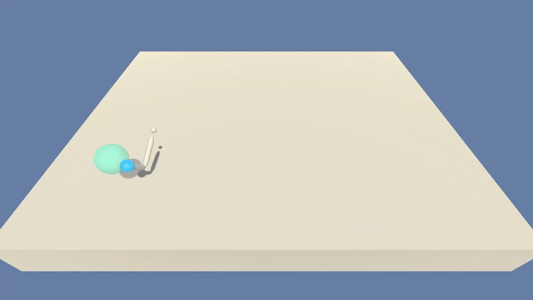
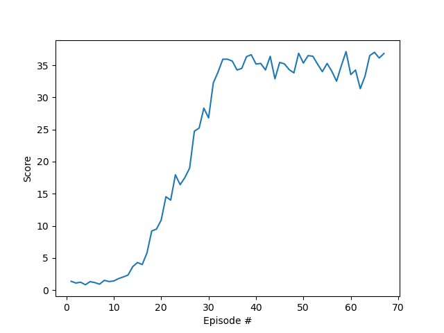

# Reacher Project

In a [Unity ML](https://github.com/Unity-Technologies/ml-agents) environment, we train a double-jointed arm `agent` to reach moving objects.  A reward of `+0.1` is provided for each step that the agent's hand is in the goal location.  The goal is to maintain its position at  the target location for as many time steps as possible. The task is episodic and the environment is considered solved when the agent manages to score `+30` on average over `100` consecutive episodes over all agents. We use `20` agents version of the environment for the training process.

The observation space consists of `33` variables  corresponding to position, rotation, velocity, and angular velocities of the arm.  Each `action` is a vector with `four` numbers, corresponding to  torque applicable to two joints.  Every entry in the action vector must  be a number between `-1` and `1`.

### Training the Agent 
Before training the agent doesn't really know what's going on:

After training, the agent knows how to consistently reach towards the moving target:

Training took 67 episodes with the `DDPG` implementation:

The agents seem to explore the environment for the first 10-13 episodes and then "understand" what it takes to get better results.

### DDPG Algorithm and Network Architecture

We implement a `Deep Deterministic Policy Gradient Policy` algorithm to train the agent. This approach aims to combine the best of `Deep Q Learning` and `Deterministic Policy Gradient` methods and is more conveniently called `DDPG`. The method was first introduced in [this paper](https://arxiv.org/abs/1509.02971), in which the authors successfully solved an array of advanced physics simulation problems in [MuJoCo](http://www.mujoco.org/) environments. The pseudocode of the algorithm can be found on `page 5` of the paper. 

We run the environment using `20 agents`, each with its own copy of the environment to explore the environment simultaneously. In the paper, an agent has `4` deep neural networks to estimate their policy: 2 for `Actor` and 2 for `Critic`. We use similar approach by implementing, for each agent, each deep neural net with `3` hidden layers and rectified linear unit activation functions between the layers, as follows:  

    Actor(
      (fc1): Linear(in_features=33, out_features=64, bias=True)
      (fc2): Linear(in_features=64, out_features=128, bias=True)
      (fc3): Linear(in_features=128, out_features=4, bias=True)
    )
    Critic(
      (fcs1): Linear(in_features=33, out_features=64, bias=True)
      (fc2): Linear(in_features=68, out_features=128, bias=True)
      (fc3): Linear(in_features=128, out_features=1, bias=True)
    )

Note that for the `Critic`, the `fc2` layer input size is `fcs1_units + action_size` .

For the `Actor`, forward function is forced between  `-1` and `1`  by using the `tanh` to deal with `continuous` action space. Forward function for `Critic` has linear output .

To force some exploration and to make the training process more stable, we apply a `Uhlenbeck& Ornstein` (stochastic) process to add some `noise` to neural network weights, independently for each agent.

Parameters used in training process:

    # Training Process
    self.N_EPISODES = 10000  # max episodes
    self.MAX_T = 1200  # max steps per episode
    
    # Agent
    self.AGENT_SEED = 0  # random seed for agent
    self.BUFFER_SIZE = int(1e4)  # replay buffer size
    self.BATCH_SIZE = 128  # minibatch size
    self.GAMMA = 0.99  # discount factor
    self.TAU = 0.001  # interpolation parameter for soft update of target parameters
    self.WEIGHT_DECAY = 0  # L2 weight decay
    
    # Network
    self.NN_SEED = 0  # random seed for Pytorch operations / neural nets
    self.LR_ACTOR = 0.001  # learning rate of the actor
    self.FC1_UNITS_ACTOR = 64  # size of first hidden layer, actor
    self.FC2_UNITS_ACTOR = 128  # size of second hidden layer, actor
    
    self.LR_CRITIC = 0.001  # learning rate of the critic
    self.FC1_UNITS_CRITIC = 64  # size of first hidden layer, critic
    self.FC2_UNITS_CRITIC = 128  # size of second hidden layer, critic
    
    # Ornstein-Uhlenbeck Process
    self.MU = 0.  # average
    self.THETA = 0.15  # drift
    self.SIGMA = 0.2  # volatility

Weights of the trained agent neural network are saved in the `outputs/` folder in this repository. Use these weights to watch a trained agent interact with the environment.

### Ideas for Further Research
It's always fun (and sometimes useful) to tweak hyperparameters to try and get better results. However, the algorithm solves the environment in less than 10 minutes with basic gaming laptop (quad core i7 along with 6GB GPU), so this won't add much value. Would be interesting to throw other [Unity ML](https://github.com/Unity-Technologies/ml-agents) as well as [OpenAI Gym](https://gym.openai.com/) environments at this algorithm and see how it performs.

To further improve this algorithm, we could try prioritised replay buffer introduced in this [paper](https://arxiv.org/abs/1511.05952) and implemented for example in this [repository](https://github.com/ShangtongZhang/DeepRL). Would be interesting to run the algorithm on multiple 20 agent environments and see if running e.g. 100 or 120 agents simultaneously would speed up the training process.

### Sources:

[Sutton, Richard & Barto, Andrew. Reinforcement Learning: An introduction](http://incompleteideas.net/book/RLbook2018.pdf)

[Continuous control with deep reinforcement learning](https://arxiv.org/abs/1509.02971)

[Benchmarking Deep Reinforcement Learning for Continuous Control](https://arxiv.org/abs/1604.06778)

[Grokking Deep Reinforcement Learning](https://livebook.manning.com/book/grokking-deep-reinforcement-learning)

[Udacity Deep Reinforcement Learning Nanodegree](https://www.udacity.com/course/deep-reinforcement-learning-nanodegree--nd893)

[Udacity Deep Reinforcement Learning Git](https://github.com/udacity/deep-reinforcement-learning)

